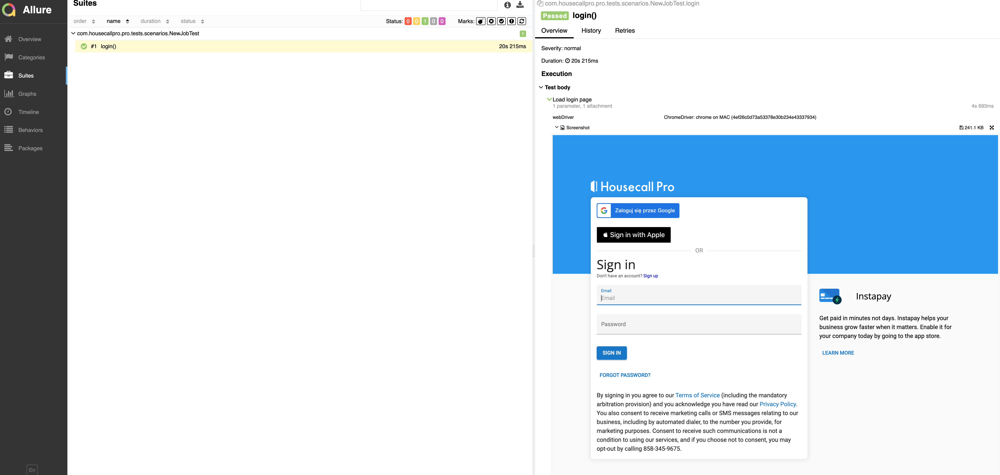

# Example project

This is a **demonstration** example project for end to end UI testing with **WebDriver** + **Spring boot** + **JUnit 5**
+ **Allure**.

This approach allows running tests in parallel, returning correct instance of Webdriver for each thread.

## Prepare tests

Update credentials in application.yml file. You might use `export` either provide spring profile. If latter, provide the
active profile in `application.yaml` file, i.e. as below:

```yaml
spring:
  profiles:
    active: local
```

## Run tests

Run tests from IDE or by maven command:

```shell
mvn clean test
```

## Reporting

Generate Allure report:

```shell
mvn allure:serve
```

